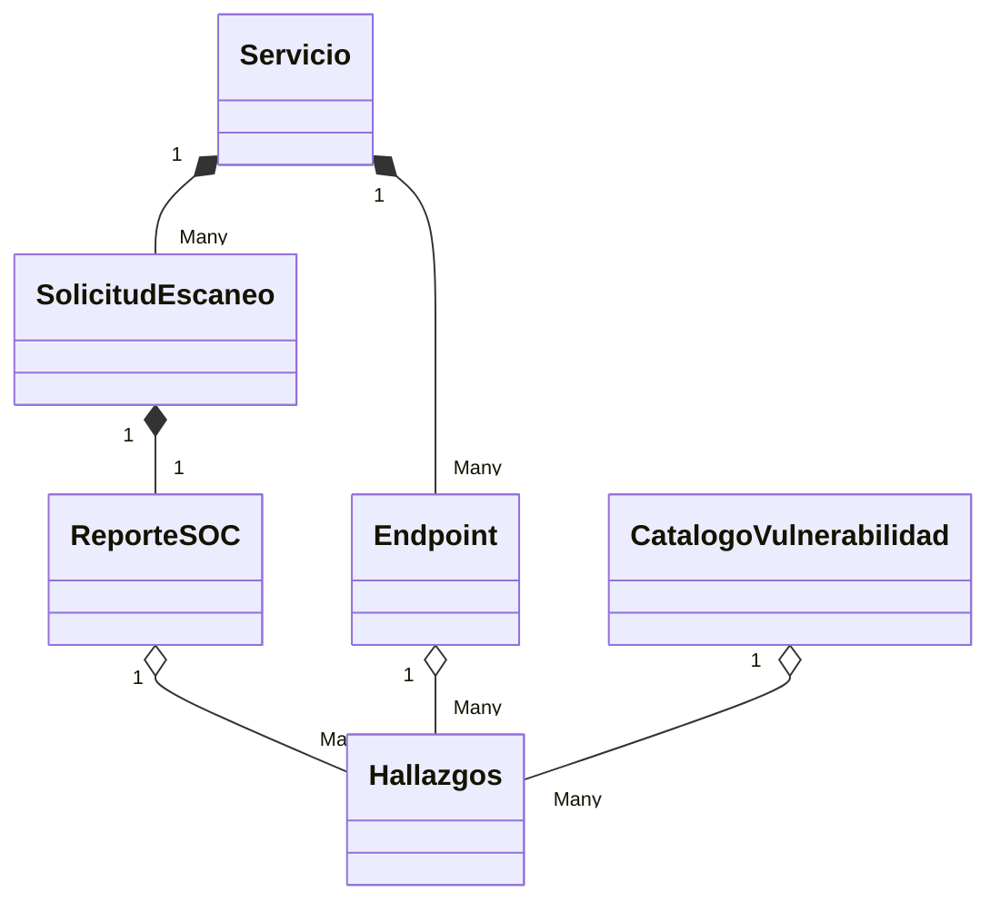
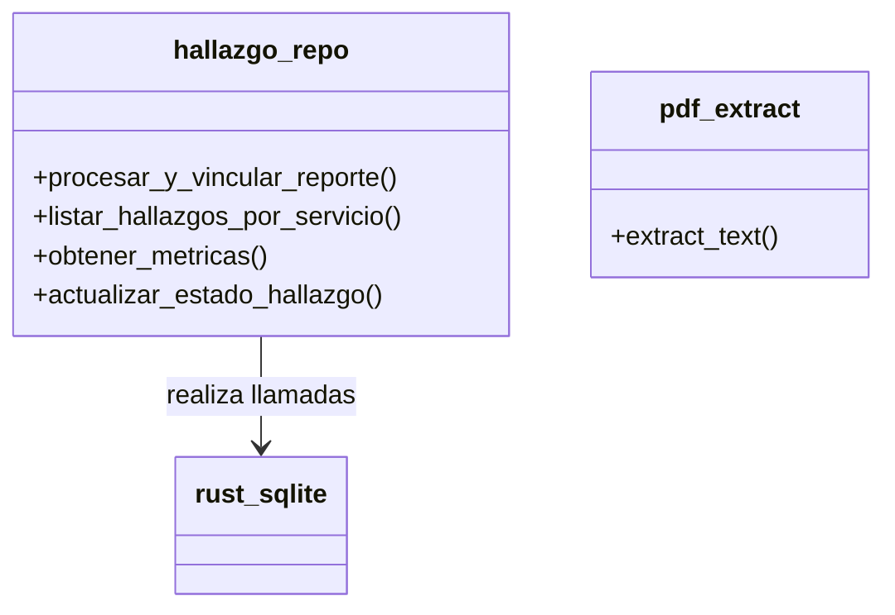
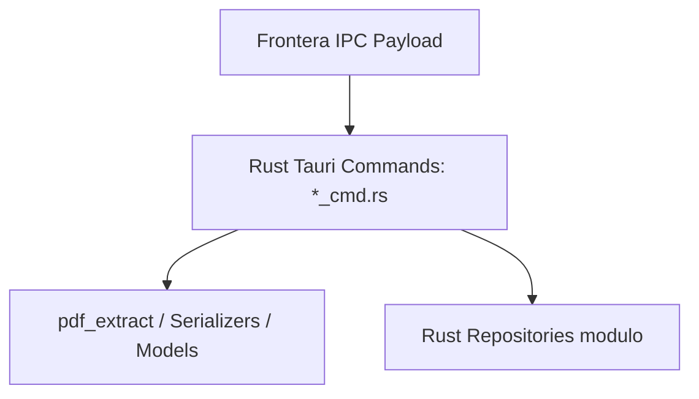
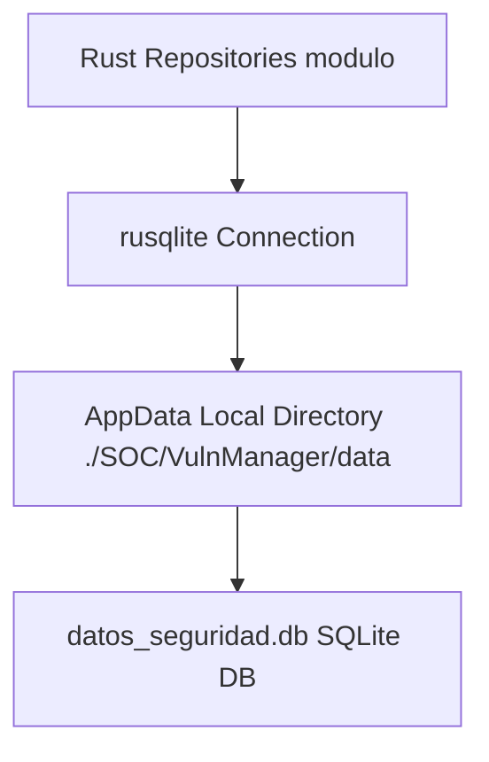
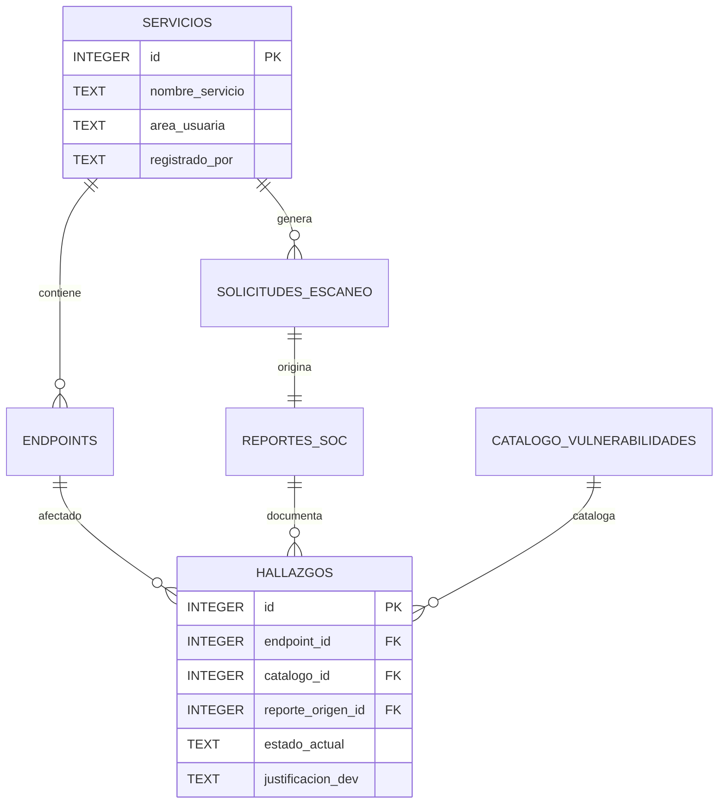

# Resumen y Documentación Completa del Sistema VulnManager

Este documento contiene la memoria técnica y arquitectónica completa del proyecto **VulnManager**, elaborada bajo un enfoque y modelado orientado a objetos. 

VulnManager es un sistema estructurado sobre **Angular 19** para el Front-end y **Rust (Tauri v2)** para la integración al sistema operativo y servicios de backend locales con **SQLite**.

---

## Fase 1: Metodología y Requerimientos

### 1.1 Metodología
Se sigue un enfoque iterativo, propio de los modelos híbridos, que combina las fases tradicionales del **Proceso Unificado (UP)** adaptadas al desarrollo ágil, aprovechando la separación de capas inherente de la arquitectura cliente-backend embebido:
- **Flujos de Trabajo**: Requerimientos funcionales, Análisis Orientado a Objetos (OO), Arquitectura (separación UI/TauriIPC), y Despliegue.

### 1.2 Modelo de Requerimiento

#### Cuadro de requerimientos funcionales
| Identificativo | Nombre | Descripción |
| :--- | :--- | :--- |
| **RF-01** | Gestión de Servicios (Proyectos) | El sistema debe permitir registrar los diferentes servicios o áreas usuarias bajo los cuales se enmarcan las apps. |
| **RF-02** | Ingesta Ágil de Endpoints | El sistema procesará textos pegados desde Excel o Portapapeles, aplicando expresiones regulares para clasificar automáticamente URLs y verbos HTTP. |
| **RF-03** | Procesamiento de Evidencia en PDFs | El usuario debe poder importar reportes nativos en PDF (ej. Reportes de Fortify), para que el motor backend extraiga su contenido binario. |
| **RF-04** | Detección de Hallazgos Automática | El sistema debe decodificar el texto leído del documento y parsear de forma automática vulnerabilidades y asociarlas al proyecto correspondiente. |
| **RF-05** | Trazabilidad y Gestión de Estados | Todo hallazgo requiere poder ser tipificado y reclasificado (Abierta, Levantada, Falso Positivo, Excepción) manteniendo un histórico de aprobadores justificados. |
| **RF-06** | Métricas en tiempo real | Tableros de resumen con estados consolidando hallazgos crudos vs. analizados o en seguimiento por grado de severidad crítica/alta/media/baja. |

#### Cuadro de requerimientos no funcionales
| Identificativo | Nombre | Descripción |
| :--- | :--- | :--- |
| **RNF-01** | Privacidad (Offline First) | La aplicación funciona al 100% desconectada sin llamados a Internet, protegiendo reportes sensibles de clientes utilizando un contenedor de SQLite de aplicación local en Windows (`AppData`). |
| **RNF-02** | Portabilidad y Empaquetado | Empaquetado binario compilado integrando renderizadores de Webview del Sistema Operativo a través de la librería Tauri. |
| **RNF-03** | Rendimiento PDF | Las tareas intensivas como conversión texto-pdf y regex paralelos los realiza Rust previniendo el colapso del Hilo principal en Web UI del usuario. |

### 1.3 Relación de actores y su descripción
1. **Analista SOC (Seguridad)**: Realiza tareas de ingesta del alcance (URLs) y lanza el escaneo procesando el volcado de los reportes PDF. Registra incidentes originando los datos base.
2. **Desarrollador / Stakeholder**: Perfil auditado externo que presenta las justificaciones a hallazgos, solicitando un descargo como Falso positivo o la aceptación formal de riesgos.
3. **Auditor / Administrador**: Es quien autoriza un cambio de estado basándose en la evidencia. Utiliza el Dashboard para consolidar métricas.

### 1.4 Relación de casos de uso
| Código | Caso de Uso | Actores involucrados |
| :--- | :--- | :--- |
| **CU-01** | Definir Alcance de Servicio | Analista SOC |
| **CU-02** | Extraer Vulnerabilidades del PDF | Analista SOC |
| **CU-03** | Aprobar cambio de estado (Remediación/Justificación) | Auditor |
| **CU-04** | Supervisar Rendición de Hallazgos (Métricas) | Analista SOC / Auditor |

#### Modelo de Casos de Uso de Requerimiento
```mermaid
usecaseDiagram
    actor "Analista SOC" as analista
    actor "Auditor" as auditor

    usecase "CU-01: Definir Alcance Servicio" as CU1
    usecase "CU-02: Extraer Vulns del PDF" as CU2
    usecase "CU-03: Aprobar cambio estado" as CU3
    usecase "CU-04: Supervisar Métricas" as CU4
    
    analista --> CU1
    analista --> CU2
    analista --> CU4
    auditor --> CU3
    auditor --> CU4
```

#### Plantilla de especificación de casos de uso (Ejemplo: CU-02)
- **ID y Nombre:** CU-02: Extraer Vulnerabilidades del PDF
- **Actor:** Analista SOC.
- **Precondiciones:** El Analista ingresó los datos del servicio a evaluar, cuenta con una Solicitud Inicial abierta y dispone del archivo físico .pdf con los descubrimientos crudos (Fortify/Nessus).
- **Flujo Principal:** 
  1. El Analista accede al "Escáner" y presiona "Seleccionar PDF".
  2. El sistema abre el Diálogo nativo, el usuario selecciona un reporte en su explorador de archivos.
  3. El sistema manda una señal al backend Rust para extraer su texto.
  4. El Frontend evalúa el gran bloque de texto con Regex extrayendo matriz de resultados.
  5. El usuario guarda los datos y el sistema registra en el catálogo e inserta relacionalmente en Base de Datos.
- **Postcondiciones:** La base de datos tiene nuevos Hallazgos creados con estado base predefinido (Abierta).

#### Matriz de requerimientos
| Requerimiento Funcional | Casos de Uso (Relacionados) |
| :--- | :--- |
| **RF-01** | CU-01 |
| **RF-02** | CU-01 |
| **RF-03, RF-04** | CU-02 |
| **RF-05** | CU-03 |
| **RF-06** | CU-04 |

---

## Fase 2: Análisis Orientado a Objetos

### 2.1 Modelo de Análisis
El sistema se separa drásticamente entre fronteras lógicas: 
- UI Reactiva basada en Signals del Frameowrk (Angular Front).
- Motores y Puertos controladores IPC (Tauri Rust Backend).

### 2.2 Modelo Conceptual de Clases


### 2.3 Listas de Clasificación de Clases (MVC adaptado a Front/IPC)

#### Lista de Clases de Interfaz (Componentes Angular)
- `MainLayoutComponent` (Estructura base)
- `DashboardComponent` (Vista Analítica CU-04)
- `IngestaComponent` (Capturador portapapeles y mapeo CU-01)
- `EscanerComponent` (Visualizador lectura y regex CU-02)
- `VulnerabilidadesComponent` (Administración de CRUD tabla)
- `ContextoAuditoriaComponent` (Formularios justificativos CU-03)

#### Lista de Clases de Control
**Servicios TS y Comandos Tauri IPC:**
- `AppStoreService` (Signal state global frontend)
- `ServicioService` (Wrappers inyectores en Angular)
- `servicio_cmd.rs`, `pdf_cmd.rs`, `endpoint_cmd.rs`, `hallazgo_cmd.rs` (Controladores lógicos Rust que abren conexiones, validan requests y devuelven respuestas HTTP-like estructuradas al front).

#### Lista de Clases de Entidades (Rust Models / Interfaces TS)
- `Servicio` / `SERVICIOS`
- `Endpoint` / `ENDPOINTS`
- `SolicitudEscaneo` / `SOLICITUDES_ESCANEO`
- `ReporteSOC` / `REPORTES_SOC`
- `CatalogoVulnerabilidad` / `CATALOGO_VULNERABILIDADES`
- `Hallazgo` / `HALLAZGOS`

### 2.4 Modelo Lógico de Clases
En este nivel consideramos las operaciones CRUD dentro de los servicios de repositorio. El backend de Rust incluye las "Clases Lógicas" agrupadas en el módulo `repositories`.



---

## Fase 3: Diseño Orientado a Objetos

### 3.1 Estructura Modular del SWOO
- **Módulo Core**: Autenticación simulada / Guards, control de vistas del Drawer e inyección de dependencias estáticas.
- **Módulo Operativo (Servicios/Scope)**: Registros de sistemas y sub-endpoints por métodos POST/GET, validación Excel copy-paste.
- **Módulo Análisis de Evidencias (Report Engine)**: Escáner binario a texto, transformador a JSON por medio de Expresiones Regulares asiladas y empaquetador del Payload asíncrono.
- **Módulo Contextual (Mitigaciones)**: Actualización de perfiles técnicos del hallazgo con Justificaciones y cambios de vida.

### 3.2 Diseño de Ventanas
1. **Login**: Acceso nominal inicial.
2. **Dashboard**: Panel superior (Selector de servicio de turno). Panel central (Widgets de métricas radiales y contadores con señales de semáforo rojo/amarillo/verde).
3. **Ingesta**: Área extensa de captura (textarea para pegar). Tablas renderizadas Reactivas con endpoints interpretados desde el portapapeles.
4. **Escaner**: Botón nativo de apertura a File Explorer Windows. Trazabilidad Form fields. Data Grid de Pre-visualización de hallazgos Parseados.
5. **Matriz Vulnerabilidades**: Data Table robusta. Botones flotantes en fila para abrir diálogo de Justificación u Acción "Cambio de Estado".

### 3.3 Diseño de Reportes
- **Histórico de Cambios de Estado**: Desplegado en las validaciones de contexto, permite visualizar la evolución (Ej. `Crítica` -> `Abierta` -> `Excepción` con firma de `AuditorX` y Justificación). Embebido desde la tabla o vistas del Dashboard.

### 3.4 Diagrama de la Capa de Presentación
```mermaid
flowchart TD
    UI[Web UI App / HTML+CSS] --> Components[Angular Standalone Components]
    Components --> State[Signals Global State / AppStore]
    Components --> Services[Angular Injectable Services]
    Services --> IPC[@tauri-apps/api/core Invoke]
```

### 3.5 Diagrama de la Capa de Negocio


### 3.6 Diagrama de la Capa de Datos


### 3.7 Diagrama de Componentes
```mermaid
componentDiagram
    [VulnManager Front-End\n(Angular TS/HTML)] as Front
    [Tauri Application Runtime\n(Rust API WebView2)] as Tauri
    [OS Local FileSystem] as Files

    Front -right-> Tauri : JS IPC Proxy
    Tauri -down-> Files : Rust API rusqlite/directories
    Tauri -up-> Front : Render HTML WebView2
```

### 3.8 Diagrama de Distribución
```mermaid
deploymentDiagram
    node "Cliente MS Windows 10/11" {
        node "Proceso Desktop (EXE)" {
            component TauriCore
            component WebView2Render
        }
        node "Almacenamiento Persistente" {
            artifact "AppData/Local/SOC/VulnManager/data/datos_seguridad.db"
        }
    }
```

---

## Fase 4: Modelo Físico e Implementación

### 4.1 Modelo Físico
El modelo de datos relacional asegura la integridad referencial y las dependencias temporales de los hallazgos mediante restricciones lógicas de SQLite.



### 4.2 Creación de Esquema y Tablas (Implementación)
El esquema se encuentra pre-programado y empaquetado en `./DB/schema.sql`. Al iniciar la aplicación, el motor de base de datos ejecuta el DDL de forma silenciosa e instantánea si detecta que la Base de datos del usuario es nueva.

```sql
-- Principales Estructuras Físicas Configurales DDL
PRAGMA foreign_keys = ON;

CREATE TABLE SERVICIOS (
    id INTEGER PRIMARY KEY AUTOINCREMENT,
    nombre_servicio TEXT NOT NULL,
    area_usuaria TEXT NOT NULL,
    registrado_por TEXT NOT NULL,
    fecha_creacion DATETIME DEFAULT CURRENT_TIMESTAMP,
    fecha_actualizacion DATETIME DEFAULT CURRENT_TIMESTAMP
);

CREATE TABLE CATALOGO_VULNERABILIDADES (
    id INTEGER PRIMARY KEY AUTOINCREMENT,
    nombre_vulnerabilidad TEXT NOT NULL UNIQUE,
    severidad TEXT NOT NULL CHECK(severidad IN ('Crítica', 'Alta', 'Media', 'Baja', 'Informacional', 'Mejor Práctica')),
    descripcion_traducida TEXT
);

CREATE TABLE HALLAZGOS (
    id INTEGER PRIMARY KEY AUTOINCREMENT,
    endpoint_id INTEGER NOT NULL,
    catalogo_id INTEGER NOT NULL,
    reporte_origen_id INTEGER NOT NULL,
    reporte_cierre_id INTEGER,
    estado_actual TEXT NOT NULL CHECK(estado_actual IN ('Abierta', 'Levantada', 'Falso Positivo', 'Excepción')),
    justificacion_dev TEXT,
    aprobado_por TEXT,
    fecha_cambio_estado DATETIME,
    FOREIGN KEY (endpoint_id) REFERENCES ENDPOINTS(id) ON DELETE RESTRICT,
    FOREIGN KEY (catalogo_id) REFERENCES CATALOGO_VULNERABILIDADES(id) ON DELETE RESTRICT,
    FOREIGN KEY (reporte_origen_id) REFERENCES REPORTES_SOC(id) ON DELETE RESTRICT,
    FOREIGN KEY (reporte_cierre_id) REFERENCES REPORTES_SOC(id) ON DELETE SET NULL
);
```
